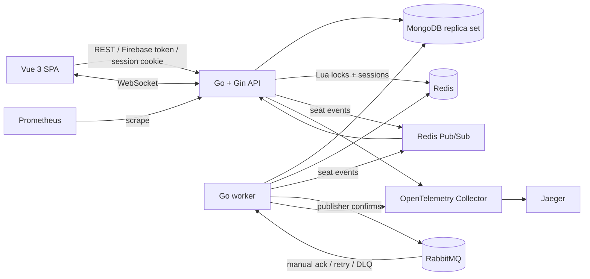

# Cinema Ticket Booking System

A full-stack take-home assignment focused on the hard part of cinema booking: preserving correct seat ownership when many clients race for the same seat. The system uses Redis for atomic distributed holds, MongoDB transactions and conditional writes for durable state, WebSockets for live seat maps, and a transactional RabbitMQ outbox for booking notifications.

## Architecture



The deployable application remains one API, one background worker, and one frontend. MongoDB is a single-node local replica set so the four critical state transitions can use multi-document transactions.

## Technology

- **Go 1.22 + Gin** for explicit service boundaries and a small runtime.
- **MongoDB** for movies, materialized showtime seats, holds, bookings, audit logs, identities, outbox events, and notification records.
- **Redis** for all-or-nothing seat locks, OAuth state, application sessions, rate limits, and cross-process seat event fan-out.
- **RabbitMQ** for durable `booking.confirmed` notification delivery with publisher confirms, retry queues, acknowledgements, and a DLQ.
- **Vue 3 + TypeScript + Vite + Pinia** for the reviewer interface.
- **Firebase Authentication and direct Google OpenID Connect** as two separate login paths that link to one local user.
- **Docker Compose, Prometheus, OpenTelemetry, and Jaeger** for local delivery and inspection.

## Repository structure

```text
backend/
  cmd/                 API, worker, seed, and concurrency executables
  internal/            auth, domain, locks, services, HTTP, messaging, realtime
  docs/openapi.yaml    OpenAPI 3.1 contract
frontend/
  src/                 Vue views, router, auth store, API client, styles
deploy/                Prometheus and OpenTelemetry configuration
docs/                  architecture, threat model, Postman, secret rotation
scripts/               Mongo replica initialization and verification
docker-compose.yml     complete local topology
```

## Running the system

1. Copy the environment template:

   ```bash
   cp .env.example .env
   ```

2. Configure both authentication paths as described below.

3. Start everything:

   ```bash
   docker compose up --build
   ```

The Mongo replica set, indexes, RabbitMQ topology, and deterministic future seed data are created automatically. Re-running the seed is safe:

```bash
make seed
```

Local URLs:

- Frontend: <http://localhost:3000>
- API: <http://localhost:8080>
- API readiness: <http://localhost:8080/health/ready>
- Worker metrics/health: <http://localhost:9091/metrics>
- Swagger UI: <http://localhost:8081>
- RabbitMQ management: <http://localhost:15672>
- Prometheus: <http://localhost:9090>
- Jaeger: <http://localhost:16686>

The application can start without cloud credentials so its public catalogue and infrastructure can be inspected, but `/health/ready` remains `503` and login endpoints return `AUTH_PROVIDER_UNAVAILABLE` until both providers are configured. There is intentionally no development authentication bypass.

## Authentication setup

### Firebase Google Sign-In

1. Create a Firebase project and web app.
2. Enable Google provider at Sign-in method in Firebase Authentication.
3. Add `localhost` as an authorized domain.
4. Create a Firebase service account and set:
   - `FIREBASE_PROJECT_ID`
   - `FIREBASE_CLIENT_EMAIL`
   - `FIREBASE_PRIVATE_KEY` using literal `\n` sequences in `.env`
5. Copy the web application values into all `VITE_FIREBASE_*` variables.

The browser obtains a Firebase ID token. The API verifies that token with Firebase Admin, extracts only verified provider claims, and assigns the local role from `ADMIN_EMAILS`.

### Direct Google OAuth / OpenID Connect

1. Create an OAuth 2.0 **Web application** client in Google Cloud.
2. Add this authorized redirect URI:

   ```text
   http://localhost:3000/api/v1/auth/google/callback
   ```

3. Set `GOOGLE_OAUTH_CLIENT_ID` and `GOOGLE_OAUTH_CLIENT_SECRET`.

The backend uses the authorization-code flow with state, nonce, and PKCE. It validates the returned ID token, discards Google tokens, and creates an opaque Redis session in an HttpOnly, SameSite cookie. Cookie-authenticated mutations also require the session-bound `X-CSRF-Token` returned by `/auth/me`.

### Identity linking and roles

Each provider identity is unique by `(provider, subject)`. A new identity may attach to an existing user only when both providers assert the same normalized, verified email. `ADMIN_EMAILS` is evaluated server-side on every identity/session resolution; neither client can submit a role or trusted user ID.

## Booking flow

1. The user authenticates through Firebase or direct Google OAuth.
2. The frontend loads the current MongoDB seat snapshot and opens a showtime WebSocket.
3. The user chooses one or more `AVAILABLE` seats.
4. The API validates the showtime and all seat IDs, then atomically acquires every Redis key.
5. A MongoDB transaction conditionally changes exactly that many seats to `LOCKED` and inserts the hold.
6. A Redis Pub/Sub event reaches API WebSocket rooms; other clients disable the seats.
7. Checkout counts down from the server-provided `expires_at` and accepts only mock payment.
8. Confirmation verifies Redis ownership and transactionally changes the seats to `BOOKED`, inserts one booking and audit record, confirms the hold, and writes an outbox event.
9. The outbox worker publishes `booking.confirmed` to RabbitMQ using persistent messages and publisher confirms.
10. The notification consumer records and logs an idempotent mock notification, then acknowledges the delivery.

## Redis lock strategy

One key represents one showtime seat:

```text
seatlock:{showtime_id}:{seat_id}
```

The value proves ownership:

```text
{hold_id}:{user_id}:{random_lock_token}
```

The default TTL is five minutes. Before invoking Redis, seat IDs are parsed, deduplicated, and sorted. One Lua script checks all keys first and uses `PSETEX` only when every key is free, so a multi-seat hold is all-or-nothing. A second script verifies every ownership value. Release uses a third script that deletes only values equal to the expected owner; the application never performs an unconditional lock `DEL`.

Redis and MongoDB do not share a transaction. Redis acquisition therefore occurs first. If the Mongo transaction aborts or updates fewer seats than requested, the API compensates with ownership-safe Redis release and records `SYSTEM_ERROR`. A failed cleanup can delay availability only until TTL; MongoDB conditions still prevent double booking.

## Durable state and double-booking prevention

MongoDB is authoritative. The protection layers are:

1. Atomic Redis multi-key acquisition.
2. Conditional `AVAILABLE`/expired-`LOCKED` to `LOCKED` updates.
3. Replica-set transactions for hold, release, confirmation, and expiration.
4. Exact modified-count checks for every multi-seat transition.
5. `LOCKED` to `BOOKED` requires the same hold, user, and an unexpired timestamp.
6. Expiration releases only `LOCKED` seats whose `hold_id` still matches.
7. Unique showtime-seat, hold idempotency, booking hold, confirmation idempotency, and booking-number indexes.

A `BOOKED` seat is excluded from every lock/release condition and can never return to `AVAILABLE`.

## Hold expiration

Redis naturally expires the coordination key. Every five seconds the worker scans expired `ACTIVE` holds. A transaction first claims the `ACTIVE` hold, conditionally releases only its matching seats, changes it to `EXPIRED`, and adds both `BOOKING_TIMEOUT` and `SEAT_RELEASED`. Concurrent workers are safe because only one transaction can change the active hold; stale work cannot release a confirmed or newly held seat.

## WebSocket consistency

`GET /api/v1/ws/showtimes/:showtimeId` groups connections by showtime and immediately sends a MongoDB `snapshot`. API and worker processes publish `seat.locked`, `seat.released`, and `seat.booked` through Redis Pub/Sub. The API hub sends heartbeat pings, removes disconnected or backpressured clients, and never includes another user's identity.

Pub/Sub and WebSockets are acceleration paths, not authoritative storage. The frontend refetches the complete seat map after reconnect to recover missed events.

## RabbitMQ reliability

```text
Mongo booking transaction
        ↓ inserts
transactional outbox
        ↓ publisher confirm
booking.confirmed exchange
        ↓ manual acknowledgement
mock notification consumer
```

The worker leases pending outbox rows, publishes persistent messages with mandatory routing and confirms, then marks them published. Failure returns the row to `PENDING` with capped exponential backoff. This closes the post-commit message-loss window of direct publication.

The notification consumer inserts a record unique by `event_id`, making redelivery idempotent. Failed handling routes through 5-second, 30-second, and 120-second retry queues. A fourth failure is negatively acknowledged without requeue and reaches `booking.notifications.dlq` through the dead-letter exchange.

## Audit logs

MongoDB stores and the admin UI exposes:

- `BOOKING_SUCCESS`
- `BOOKING_TIMEOUT`
- `SEAT_RELEASED` for manual and timeout release
- `SYSTEM_ERROR` for Redis failures, transaction compensation, ownership mismatch, and worker failures

Audit metadata never contains credentials, Firebase tokens, Google tokens, session tokens, CSRF tokens, or Redis lock tokens.

## Tests and verification

Run local build/unit/component checks:

```bash
make test
```

Run the mandatory infrastructure-backed concurrency scenario after the stack is built:

```bash
make test-concurrency
```

Exercise the production WebSocket snapshot and Redis Pub/Sub fan-out:

```bash
make test-websocket
```

It creates an isolated future showtime, drives 50 simultaneous authenticated HTTP hold requests through the real router and middleware with an injected test verifier, confirms the winner twice with one idempotency key, inspects MongoDB, and exits nonzero unless it observes:

```text
Total attempts: 50
Successful holds: 1
Conflicts: 49
Unexpected errors: 0
Double booking detected: false
Booking event consumed: true
Booked seat protected: true
Manual release verified: true
Expiration verified: true
Authentication linking/session/CSRF/role checks verified: true
RabbitMQ mandatory routing verified: true
```

Run clean startup smoke verification:

```bash
make verify
```

Real provider verification remains a browser test because Firebase and Google credentials are external. Before signing off, verify both buttons resolve the same Google email to one local user and that a non-admin receives `403` from `/api/v1/admin/*`.

## Security controls

- Provider signature, issuer, audience, expiry, nonce, and verified-email checks
- OAuth state replay protection and PKCE
- Opaque Redis sessions, HttpOnly/SameSite cookies, production Secure cookies
- CSRF header on cookie-authenticated mutations
- Exact credentialed CORS allowlist
- Redis-backed per-user/IP hold rate limit
- Ownership checks on holds and bookings
- One-megabyte request bodies and structural validation
- Request IDs, recovery, safe error envelopes, structured logs, and security headers
- Non-root API, worker, and frontend containers

See [docs/threat-model.md](docs/threat-model.md) and [docs/secret-rotation.md](docs/secret-rotation.md).

## Assumptions

- A hold belongs to exactly one showtime and may contain one to ten seats.
- The lock lasts five minutes and cannot be extended.
- Server UTC time controls expiration; frontend clocks are presentation only.
- Payment method `MOCK` succeeds only while the hold remains valid.
- Prices are stored in minor THB units; seeded standard seats cost THB 250.
- Confirmed bookings are immutable.
- Cancellation, refund, promotion, loyalty, food ordering, and real payment are out of scope.

## Trade-offs and known limitations

- The local MongoDB replica set has one member and is not highly available.
- Redis Pub/Sub does not replay missed events; clients repair with a REST snapshot.
- A committed manual release can leave an ownership-safe Redis key until TTL if Redis fails, temporarily reducing availability but never enabling double booking.
- Account linking intentionally trusts only provider-verified matching email and has no manual unlink UI.
- Direct Google logout deletes the application session but does not revoke the wider Google session.
- RabbitMQ, Redis, MongoDB, the API, and the worker each run as one local instance.
- External poster/font assets require internet access; functionality remains usable without them.

Future production work would include multi-node MongoDB, Redis Sentinel/Cluster, a RabbitMQ cluster, TLS termination, centralized secrets, autoscaled WebSocket fan-out, alerting dashboards, a real payment workflow, cancellations/refunds, and Kubernetes deployment.
