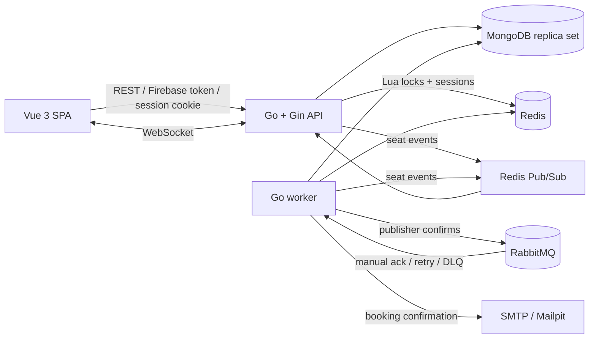

# Cinema Ticket Booking System

A full-stack focused on the hard part of cinema booking: preserving correct seat ownership when many clients race for the same seat. The system uses Redis for atomic distributed holds, MongoDB transactions and conditional writes for durable state, WebSockets for live seat maps, and a transactional RabbitMQ outbox for booking notifications.

## Architecture



The deployable application remains one API, one background worker, and one frontend. MongoDB is a single-node local replica set so the four critical state transitions can use multi-document transactions.

## Technology

- **Go 1.22 + Gin** for explicit service boundaries and a small runtime.
- **MongoDB** for movies, materialized showtime seats, holds, bookings, audit logs, identities, outbox events, and notification records.
- **Redis** for all-or-nothing seat locks, OAuth state, application sessions, rate limits, and cross-process seat event fan-out.
- **RabbitMQ** for durable `booking.confirmed` notification delivery with publisher confirms, retry queues, acknowledgements, and a DLQ.
- **SMTP + Mailpit** for asynchronous booking-confirmation email and a credential-free local inbox.
- **Vue 3 + TypeScript + Vite + Pinia** for the reviewer interface.
- **Firebase Authentication and direct Google OpenID Connect** as two separate login paths that link to one local user.
- **Docker Compose** for reproducible local delivery, with structured JSON logs for runtime inspection.

## Repository structure

```text
backend/
  cmd/                 API, worker, seed, and concurrency executables
  internal/            auth, domain, locks, mailer, services, HTTP, messaging, realtime
  docs/openapi.yaml    OpenAPI 3.1 contract
frontend/
  src/                 Vue views, router, auth store, API client, styles
docs/                  architecture, threat model, Postman, secret rotation
scripts/               Mongo replica initialization and verification
docker-compose.yml     complete local topology
```

## Running the system

1. Copy the environment template:

   ```bash
   cp .env.example .env
   ```

2. Configure both authentication paths as described below.

3. Start everything:

   ```bash
   docker compose up --build
   ```

The Mongo replica set, indexes, RabbitMQ topology, and deterministic future seed data are created automatically. Re-running the seed is safe:

```bash
make seed
```

Local URLs:

- Frontend: <http://localhost:3000>
- API: <http://localhost:8080>
- API readiness: <http://localhost:8080/health/ready>
- Worker health: <http://localhost:9091/health/live>
- Swagger UI: <http://localhost:8081>
- RabbitMQ management: <http://localhost:15672>
- Mailpit inbox: <http://localhost:8025>

The application can start without cloud credentials so its public catalogue and infrastructure can be inspected, but `/health/ready` remains `503` and login endpoints return `AUTH_PROVIDER_UNAVAILABLE` until both providers are configured. There is intentionally no development authentication bypass.

### Booking confirmation email

After a booking commits, the existing `booking.confirmed` worker flow sends a plain-text confirmation to the verified email stored on the booking. The HTTP confirmation remains successful even if SMTP is temporarily unavailable; RabbitMQ retries email delivery and eventually routes repeated failures to the notification DLQ.

Local Compose uses Mailpit without credentials. Complete a booking and open <http://localhost:8025> to inspect the message. To deliver real email, replace these environment values with an SMTP server that supports plain SMTP or STARTTLS:

```dotenv
SMTP_HOST=mail.example.com
SMTP_PORT=587
SMTP_USERNAME=cinema-smtp-user
SMTP_PASSWORD=replace-with-a-secret
SMTP_FROM=Cinema Ticket Booking <no-reply@example.com>
```

`SMTP_USERNAME` and `SMTP_PASSWORD` must either both be empty or both be configured. Implicit TLS on port 465 is not supported; use a STARTTLS endpoint such as port 587.

### Postman collection

Import [`docs/Cinema-Ticket-Booking.postman_collection.json`](docs/Cinema-Ticket-Booking.postman_collection.json). All local URLs and flow IDs are collection variables, so a separate Postman environment is not required.

1. Sign in through the frontend and copy the Firebase ID token into the collection variable `firebase_token`.
2. Run `03 - Catalogue` to select a current movie, future showtime, and available seat automatically.
3. Run `04 - Booking Confirmation Flow` or `05 - Manual Release Flow`. Test scripts preserve the generated idempotency keys and capture `hold_id` and `booking_id` for later requests.
4. Run `06 - Admin` only with an identity whose email is listed in `ADMIN_EMAILS`.

For direct Google OAuth, leave `firebase_token` empty, complete the browser authorization flow, make the resulting `cinema_session` cookie available to Postman's `localhost` cookie jar, and run `Current user` to capture the session-bound `csrf_token`.

Postman stores WebSocket requests in a different multi-protocol collection format, so the exported HTTP collection documents but does not embed the realtime endpoint. Create a separate WebSocket request for `ws://localhost:8080/api/v1/ws/showtimes/{{showtime_id}}` when inspecting seat events. See [Postman's WebSocket collection documentation](https://learning.postman.com/docs/use/send-requests/protocols/websocket/save-websocket-requests/).

## Authentication setup

### Firebase Google Sign-In

1. Create a Firebase project and web app.
2. Enable Google provider at Sign-in method in Firebase Authentication.
3. Add `localhost` as an authorized domain.
4. Create a Firebase service account and set:
   - `FIREBASE_PROJECT_ID`
   - `FIREBASE_CLIENT_EMAIL`
   - `FIREBASE_PRIVATE_KEY` using literal `\n` sequences in `.env`
5. Copy the web application values into all `VITE_FIREBASE_*` variables.

The browser obtains a Firebase ID token. The API verifies that token with Firebase Admin, extracts only verified provider claims, and assigns the local role from `ADMIN_EMAILS`.

### Direct Google OAuth / OpenID Connect

1. Create an OAuth 2.0 **Web application** client in Google Cloud.
2. Add this authorized redirect URI:

   ```text
   http://localhost:3000/api/v1/auth/google/callback
   ```

3. Set `GOOGLE_OAUTH_CLIENT_ID` and `GOOGLE_OAUTH_CLIENT_SECRET`.

The backend uses the authorization-code flow with state, nonce, and PKCE. It validates the returned ID token, discards Google tokens, and creates an opaque Redis session in an HttpOnly, SameSite cookie. Cookie-authenticated mutations also require the session-bound `X-CSRF-Token` returned by `/auth/me`.

### Identity linking and roles

Each provider identity is unique by `(provider, subject)`. A new identity may attach to an existing user only when both providers assert the same normalized, verified email. `ADMIN_EMAILS` is evaluated server-side on every identity/session resolution; neither client can submit a role or trusted user ID.

## Booking flow

1. **Authenticate the user.** The user signs in through Firebase or direct Google OAuth. Firebase requests send the verified ID token as a Bearer token. Direct OAuth requests use the opaque `cinema_session` cookie, and mutating requests must also send the session-bound `X-CSRF-Token`. The API resolves the provider identity to a server-owned user ID and role; the client cannot submit either value.
2. **Load the public catalogue.** The frontend requests `GET /api/v1/movies`, selects a movie, and loads its future sessions from `GET /api/v1/movies/:movieId/showtimes`. Only active movies and active showtimes whose start time is still in the future are returned.
3. **Load the authoritative seat map.** `GET /api/v1/showtimes/:showtimeId/seats` reads the materialized seat state from MongoDB. Each item contains the auditorium seat ID, label, server-owned price, and current `AVAILABLE`, `LOCKED`, or `BOOKED` status.
4. **Subscribe to live changes.** The frontend connects to `GET /api/v1/ws/showtimes/:showtimeId`. Receiving the initial snapshot proves that the connection has joined its showtime room; the client then refetches the authoritative REST seat map while buffering `seat.locked`, `seat.released`, and `seat.booked` hints. It replays those hints after the REST response, and repeats the same synchronization after reconnects.
5. **Select seats locally.** The user selects between one and ten seats currently shown as `AVAILABLE`. The UI treats this as a proposal only: it does not assume the seats are still free and cannot provide a trusted price, lock owner, or expiration time.
6. **Submit the hold request.** The frontend calls `POST /api/v1/showtimes/:showtimeId/holds` with the selected `seat_ids`, a new UUID in `Idempotency-Key`, and the authentication headers. It keeps the key and normalized seat fingerprint in `sessionStorage` until a successful response, so a reload after response loss automatically resubmits the same request. The hold rate limiter is applied per authenticated user and client IP before the booking service runs.
7. **Validate idempotency and input.** A missing or malformed UUID `Idempotency-Key` returns `400`. Reusing a key for the same normalized showtime and seat request returns the existing hold with `200 OK`; reusing it for a different request returns `409 IDEMPOTENCY_KEY_REUSED`. Otherwise the API parses, deduplicates, and sorts the seat IDs, rejects malformed or out-of-range seat selections with `422`, and verifies that the requested showtime is active, has not started, and owns every requested seat.
8. **Acquire all Redis locks atomically.** One ownership value containing the new hold ID, user ID, and random lock token is prepared for every requested showtime-seat key. A Lua script first checks every key and writes all keys with the five-minute TTL only when all are free. If any seat is already owned, no key is written and the API returns `409 SEAT_UNAVAILABLE`.
9. **Persist the active hold.** After Redis acquisition, a MongoDB transaction conditionally changes exactly the requested seats from `AVAILABLE` or expired `LOCKED` to `LOCKED`, attaches the hold and user ownership, stores `lock_expires_at`, and inserts one `ACTIVE` hold. An exact modified-count check prevents partial multi-seat holds.
10. **Compensate if durable persistence fails.** If the MongoDB transaction aborts or updates fewer seats than requested, the API deletes only Redis keys whose values still match this hold's ownership token. It records a `SYSTEM_ERROR` when appropriate and returns an error without exposing a partially created hold.
11. **Return and broadcast the hold.** A new hold returns `201 Created` with `hold_id`, `showtime_id`, `seat_ids`, `status`, server-generated `expires_at`, and `remaining_seconds`. The API publishes `seat.locked` through Redis Pub/Sub so every API instance can update its WebSocket clients and disable those seats.
12. **Display checkout using server time.** The frontend navigates to checkout and counts down from `expires_at`; the browser clock is presentational only. `GET /api/v1/holds/:holdId` can refresh the owned hold and remaining time. The only supported payment method is the deterministic mock method `MOCK`.
13. **Submit confirmation.** Before the hold expires, the frontend calls `POST /api/v1/holds/:holdId/confirm` with `{ "payment_method": "MOCK" }` and a separate confirmation `Idempotency-Key` retained in `sessionStorage` until success. Repeating the same hold returns its existing booking with `200 OK`, including after a response loss or reload; using an existing confirmation key for a different hold returns `409 IDEMPOTENCY_KEY_REUSED`. The first successful confirmation returns `201 Created`.
14. **Revalidate ownership and expiration.** The API loads the hold, verifies that the current user owns it, checks that it is still `ACTIVE` and unexpired, and uses Redis Lua verification to ensure every seat key still contains the expected ownership value. The MongoDB transaction takes a fresh server timestamp and repeats the hold and seat expiration conditions before committing. A released, expired, or ownership-mismatched hold returns `409 HOLD_EXPIRED`.
15. **Build trusted booking data.** The server reloads the showtime seats, movie, and auditorium from MongoDB, sorts the seat labels, and calculates the total from stored seat prices. User identity, movie title, showtime, auditorium, prices, total, and currency are never accepted from the confirmation body.
16. **Commit the booking atomically.** One MongoDB transaction conditionally changes the hold from `ACTIVE` to `CONFIRMED`, changes exactly its still-owned and unexpired seats from `LOCKED` to `BOOKED`, inserts the immutable booking, writes a `BOOKING_SUCCESS` audit log, and inserts a `PENDING` `booking.confirmed` outbox event. If any required state changed concurrently, the whole transaction aborts and no booking is created.
17. **Clean up locks and update clients.** After the transaction commits, the API ownership-safely removes the Redis seat keys and publishes `seat.booked` with the booking ID. The HTTP response returns the booking number, selected seats, total amount in minor THB units, payment status, and booking status. Clients can then use `GET /api/v1/bookings/me` or `GET /api/v1/bookings/:bookingId` to read the durable result.
18. **Deliver the asynchronous email.** The worker leases the pending outbox row, publishes a persistent `booking.confirmed` message with mandatory routing and publisher confirms, and marks the row `PUBLISHED` only after RabbitMQ confirms it. The consumer reloads the booking, sends a plain-text confirmation to the booking's verified email over SMTP, records the recipient, subject, body, and `sent_at` under the unique `event_id`, then acknowledges the message. Failures use the configured retry queues and eventually reach the DLQ instead of changing the already committed booking result.

If the user abandons checkout, `DELETE /api/v1/holds/:holdId` transactionally changes an owned `ACTIVE` hold to `RELEASED`, returns only its matching seats to `AVAILABLE`, records the audit event, safely removes the Redis ownership keys, and publishes `seat.released`. If no manual release occurs, the worker finds the expired hold, performs the equivalent guarded transition to `EXPIRED`, and broadcasts the released seats. Neither path can release a confirmed booking or a seat now owned by another hold.

## Redis lock strategy

One key represents one showtime seat:

```text
seatlock:{showtime_id}:{seat_id}
```

The value proves ownership:

```text
{hold_id}:{user_id}:{random_lock_token}
```

The default TTL is five minutes. Before invoking Redis, seat IDs are parsed, deduplicated, and sorted. One Lua script checks all keys first and uses `PSETEX` only when every key is free, so a multi-seat hold is all-or-nothing. A second script verifies every ownership value. Release uses a third script that deletes only values equal to the expected owner; the application never performs an unconditional lock `DEL`.

Redis and MongoDB do not share a transaction. Redis acquisition therefore occurs first. If the Mongo transaction aborts or updates fewer seats than requested, the API compensates with ownership-safe Redis release and records `SYSTEM_ERROR`. A failed cleanup can delay availability only until TTL; MongoDB conditions still prevent double booking.

## Durable state and double-booking prevention

MongoDB is authoritative. The protection layers are:

1. Atomic Redis multi-key acquisition.
2. Conditional `AVAILABLE`/expired-`LOCKED` to `LOCKED` updates.
3. Replica-set transactions for hold, release, confirmation, and expiration.
4. Exact modified-count checks for hold creation and confirmation, where every requested seat must transition together; release and expiration remain safely guarded by matching `hold_id` so stale work may update zero seats.
5. `LOCKED` to `BOOKED` requires the same hold, user, and an unexpired timestamp.
6. Expiration releases only `LOCKED` seats whose `hold_id` still matches.
7. Unique showtime-seat, hold idempotency, booking hold, confirmation idempotency, and booking-number indexes.

A `BOOKED` seat is excluded from every lock/release condition and can never return to `AVAILABLE`.

## Hold expiration

Redis naturally expires the coordination key. Every five seconds the worker scans expired `ACTIVE` holds. A transaction first claims the `ACTIVE` hold, conditionally releases only its matching seats, changes it to `EXPIRED`, and adds both `BOOKING_TIMEOUT` and `SEAT_RELEASED`. Concurrent workers are safe because only one transaction can change the active hold; stale work cannot release a confirmed or newly held seat.

## WebSocket consistency

`GET /api/v1/ws/showtimes/:showtimeId` groups connections by showtime and immediately sends a MongoDB `snapshot`. The frontend treats it as a registration barrier, fetches a fresh REST snapshot, buffers concurrent incremental events, and replays them after the REST result. API and worker processes publish `seat.locked`, `seat.released`, and `seat.booked` through Redis Pub/Sub. The API hub sends heartbeat pings, removes disconnected or backpressured clients, and never includes another user's identity.

Pub/Sub and WebSockets are acceleration paths, not authoritative storage. The frontend refetches the complete seat map after reconnect to recover missed events.

## RabbitMQ reliability

```text
Mongo booking transaction
        ↓ inserts
transactional outbox
        ↓ publisher confirm
booking.confirmed exchange
        ↓ manual acknowledgement
email notification consumer
        ↓ SMTP / STARTTLS
user inbox or local Mailpit
```

The worker leases pending outbox rows, publishes persistent messages with mandatory routing and confirms, then marks them published. Failure returns the row to `PENDING` with capped exponential backoff. This closes the post-commit message-loss window of direct publication.

The notification consumer skips an `event_id` that already has a notification record. For a new event it validates the recipient, sends the email, and records delivery only after the SMTP server accepts the message. Failed handling routes through 5-second, 30-second, and 120-second retry queues. A fourth failure is negatively acknowledged without requeue and reaches `booking.notifications.dlq` through the dead-letter exchange.

## Audit logs

MongoDB stores and the admin UI exposes:

- `BOOKING_SUCCESS`
- `BOOKING_TIMEOUT`
- `SEAT_RELEASED` for manual and timeout release
- `SYSTEM_ERROR` for Redis failures, transaction compensation, ownership mismatch, and worker failures

Audit metadata never contains credentials, Firebase tokens, Google tokens, session tokens, CSRF tokens, or Redis lock tokens.

## Tests and verification

Run local build/unit/component checks:

```bash
make test
```

Run the mandatory infrastructure-backed concurrency scenario after the stack is built:

```bash
make test-concurrency
```

Exercise the production WebSocket snapshot and Redis Pub/Sub fan-out:

```bash
make test-websocket
```

It creates an isolated future showtime, drives 50 simultaneous authenticated HTTP hold requests through the real router and middleware with an injected test verifier, confirms the winner concurrently and repeats confirmation with a new key, inspects MongoDB, and exits nonzero unless it observes:

```text
Total attempts: 50
Successful holds: 1
Conflicts: 49
Unexpected errors: 0
Double booking detected: false
Booking email delivered: true
Duplicate booking email suppressed: true
Booked seat protected: true
Concurrent/repeated confirmation verified: true
Atomic multi-seat acquisition verified: true
Hold idempotency and ownership verified: true
Confirmation idempotency scope verified: true
Manual release verified: true
Expiration verified: true
Authentication linking/session/CSRF/role checks verified: true
RabbitMQ mandatory routing verified: true
```

Run non-destructive startup and acceptance verification (existing Docker volumes are preserved):

```bash
make verify
```

Real provider verification remains a browser test because Firebase and Google credentials are external. Before signing off, verify both buttons resolve the same Google email to one local user and that a non-admin receives `403` from `/api/v1/admin/*`.

## Security controls

- Provider signature, issuer, audience, expiry, nonce, and verified-email checks
- OAuth state replay protection and PKCE
- Opaque Redis sessions, HttpOnly/SameSite cookies, production Secure cookies
- CSRF header on cookie-authenticated mutations
- Exact credentialed CORS allowlist
- Redis-backed per-user/IP hold rate limit
- Ownership checks on holds and bookings
- One-megabyte request bodies and structural validation
- Request IDs, recovery, safe error envelopes, structured logs, and security headers
- Validated SMTP sender/recipient addresses and credentials kept in deployment secrets
- Non-root API, worker, and frontend containers

See [docs/threat-model.md](docs/threat-model.md) and [docs/secret-rotation.md](docs/secret-rotation.md).

## Assumptions

- A hold belongs to exactly one showtime and may contain one to ten seats.
- The lock lasts five minutes and cannot be extended.
- Server UTC time controls expiration; frontend clocks are presentation only.
- Payment method `MOCK` succeeds only while the hold remains valid.
- Prices are stored in minor THB units; seeded standard seats cost THB 250.
- Confirmed bookings are immutable.
- Cancellation, refund, promotion, loyalty, food ordering, and real payment are out of scope.

## Trade-offs and known limitations

- The local MongoDB replica set has one member and is not highly available.
- Redis Pub/Sub does not replay missed events; clients repair with a REST snapshot.
- A committed manual release can leave an ownership-safe Redis key until TTL if Redis fails, temporarily reducing availability but never enabling double booking.
- Account linking intentionally trusts only provider-verified matching email and has no manual unlink UI.
- Direct Google logout deletes the application session but does not revoke the wider Google session.
- RabbitMQ, Redis, MongoDB, the API, and the worker each run as one local instance.
- SMTP acceptance and the MongoDB notification record cannot share a transaction; a worker crash in that narrow window may cause one duplicate email on retry.
- Mailpit captures local email only. Real inbox delivery requires an external SMTP service configured through environment variables.
- External poster/font assets require internet access; functionality remains usable without them.

Future production work would include multi-node MongoDB, Redis Sentinel/Cluster, a RabbitMQ cluster, TLS termination, centralized secrets, autoscaled WebSocket fan-out, alerting dashboards, a real payment workflow, cancellations/refunds, and Kubernetes deployment.
